# TinySpot  (前端代码)

## 项目简介

`TinySpot` 是基于SpringBoot + Vue开发的 AI聊天博客权限管理系统，前后端分离，后端采用了 SpringBoot  、MyBatis-plus、MySQL、Redis、WebSocket、OAuth2.0 等技术，前端采用 Vue、element-ui 等。


源代码：

|                           Github                           |
| :--------------------------------------------------------: |
|   前端代码：https://github.com/OnlyAPI/tiny-spot-vue.git   |
| 后端代码：https://github.com/OnlyAPI/tiny-spot-service.git |

!!! 提示：前后端代码毫无保留，全部开源。


## 项目功能

- 首页数据统计 + 日历 （监控数据折线图数据展示 + 日历待办事项添加）
- **AI 聊天** （已接入国内多家AI模型供应商，可以方便的进行AI聊天）
- **AI 生图** （提供了文生图接口（百度）和扩展接口，使大家可以更方便的扩展接入多家服务）
- 系统权限管理 (这个就不多说了)
  - 用户管理
  - 角色管理
  - 菜单管理
- 博客管理
  - 文章管理 （提供markdown编辑器来编写、修改文章）
  - 标签管理 （对于博客标签的管理）
  - 分类管理 （对于博客分类的管理）
- 其他功能管理
  - 系统全局文件管理 （全局上传的文件提供管理页面）
  - 系统音乐管理 （播放音乐）

- OAuth2.0 授权登录 （[QQ](https://wiki.connect.qq.com/%E6%8E%88%E6%9D%83%E7%99%BB%E5%BD%95) + [Gitee](https://gitee.com/api/v5/oauth_doc#/) + [Github](https://docs.github.com/zh/apps/oauth-apps/building-oauth-apps/authorizing-oauth-apps#web-application-flow)）
- 文件上传 （可选择上传本地或者minio服务，并且预留存储扩展接口，在yml文件中修改配置即可）
  - 本地上传
  - [minio](https://github.com/minio/minio)


## 快速启动

### 前端服务

#### 构建

```
# 1.克隆完整项目
git clone https://github.com/OnlyAPI/tiny-spot-vue.git

# 2.进入项目目录
cd tiny-spot-vue

# 3.安装依赖
npm install

# 4.启动服务
npm run dev

浏览器访问 http://localhost:9528
!!! 默认用户名密码：root/123456
```

#### 发布

```
# 构建生产环境
npm run build:prod
```


## 项目演示

登录页：

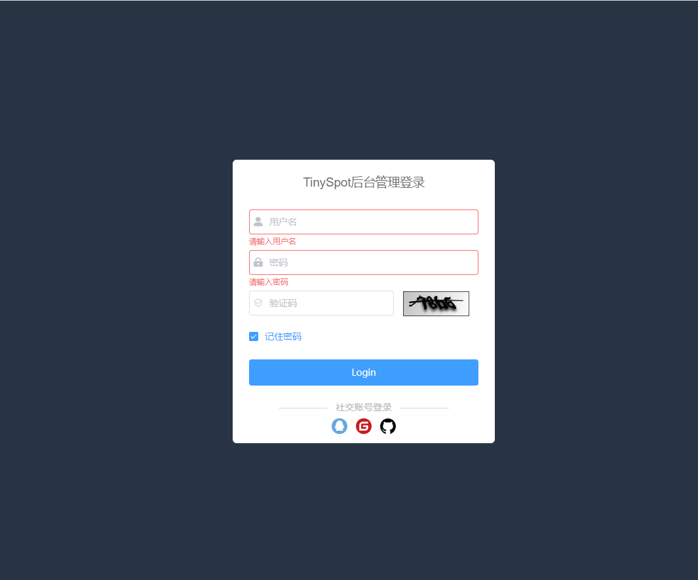

首页：

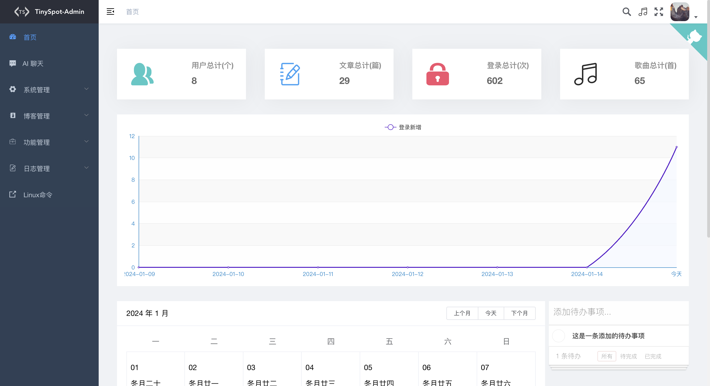

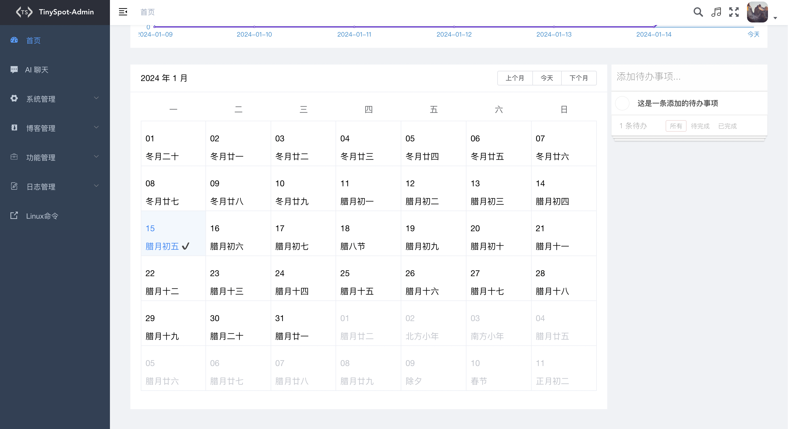


AI 聊天：

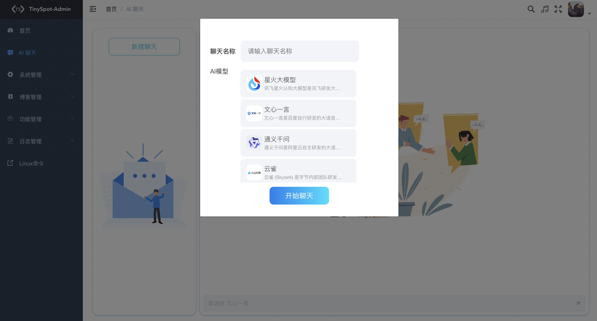

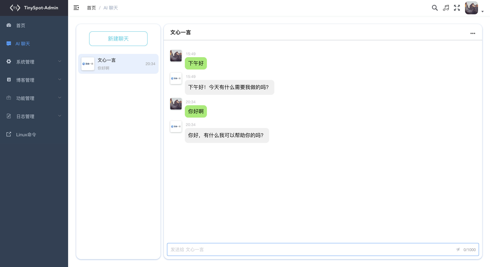


系统管理：

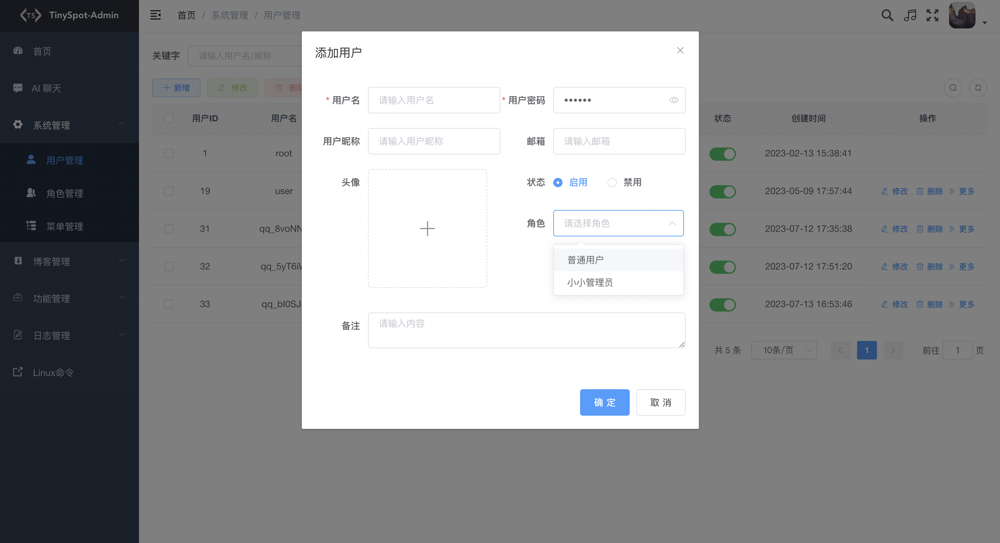

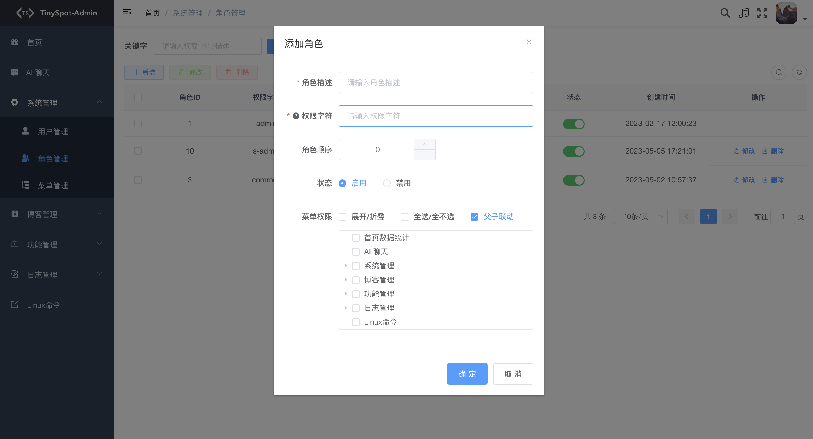

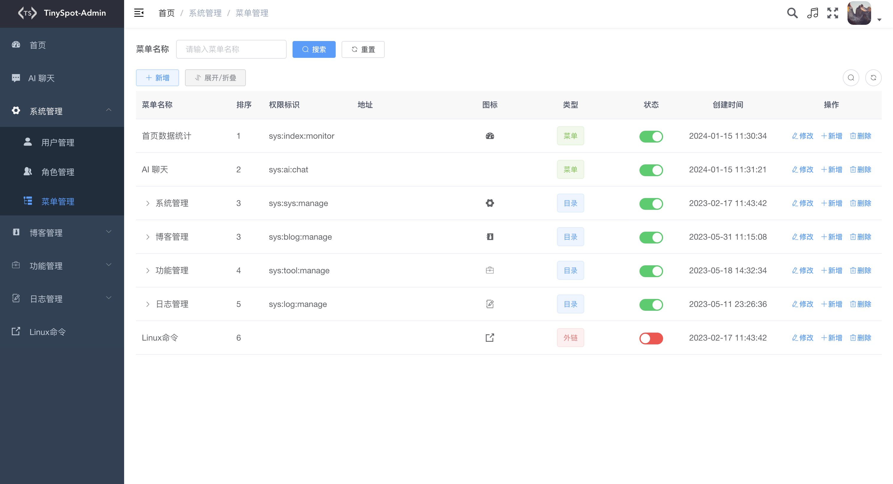

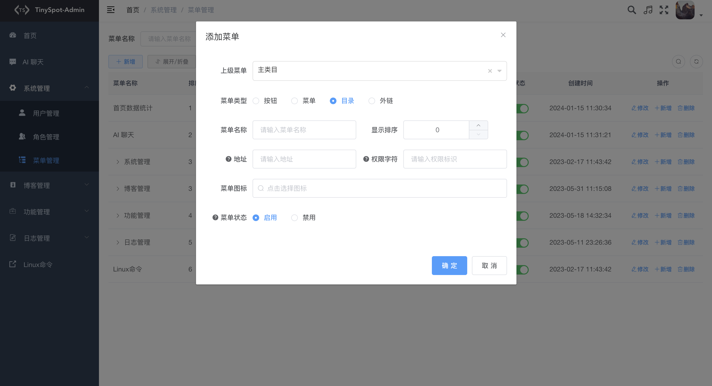


博客管理：

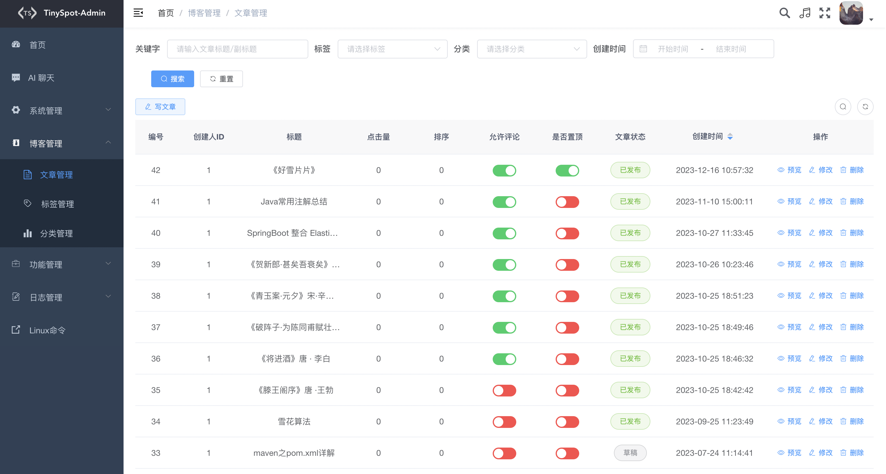

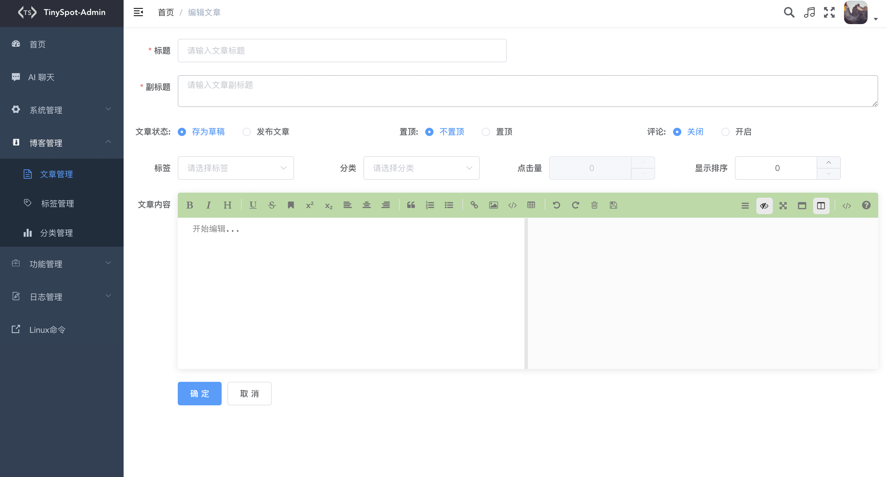

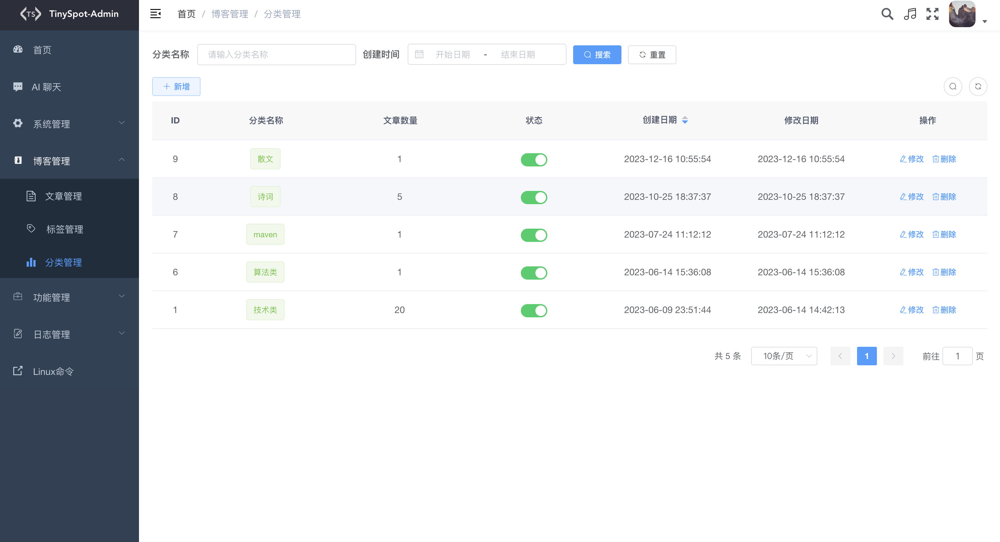

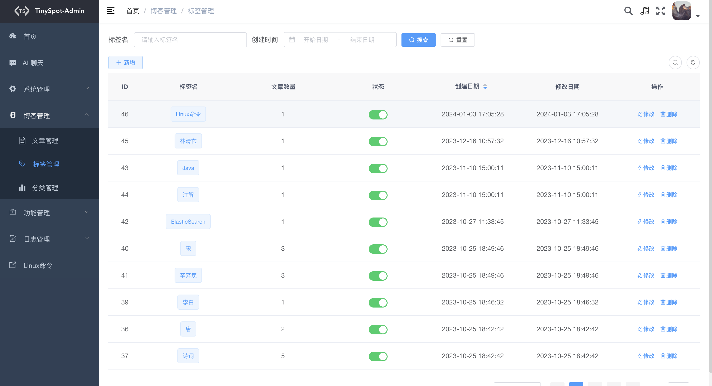


功能管理：

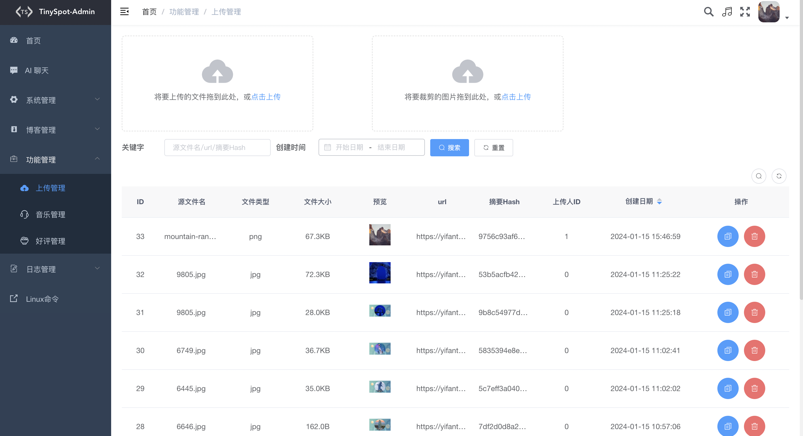

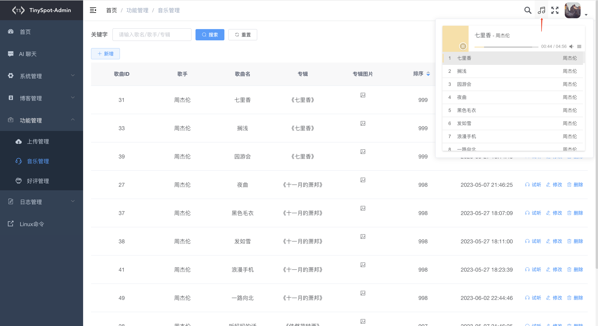


个人中心：

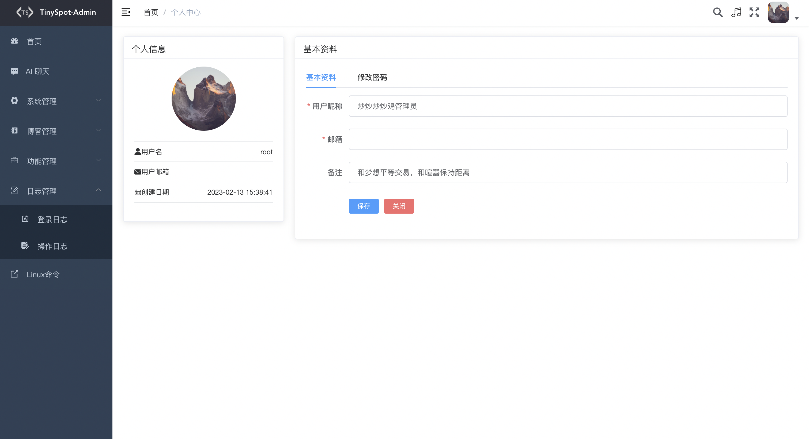


## 鸣谢

- 本人主要侧重Java开发，对于前端知识知之甚少，在项目开发中前端主要基于[vue-element-admin](https://github.com/PanJiaChen/Vue-element-admin) 和[RuoYi](https://github.com/yangzongzhuan/RuoYi)前端模板进行开发，感谢 @PanJiaChen 和 @yangzongzhuan 大佬提供的前端模板


## 说明

- 此项目为本人闲暇之余开发完成，所有代码全部开源，前后大概历经1年时间，跨度较久以及对前端代码不熟悉，避免不了有部分代码实现逻辑啰嗦，如发现不合理的地方可提出 Issues，大家一块学习成长。如果本项目对你有帮助的话，希望大家点个⭐ star ，感谢支持。